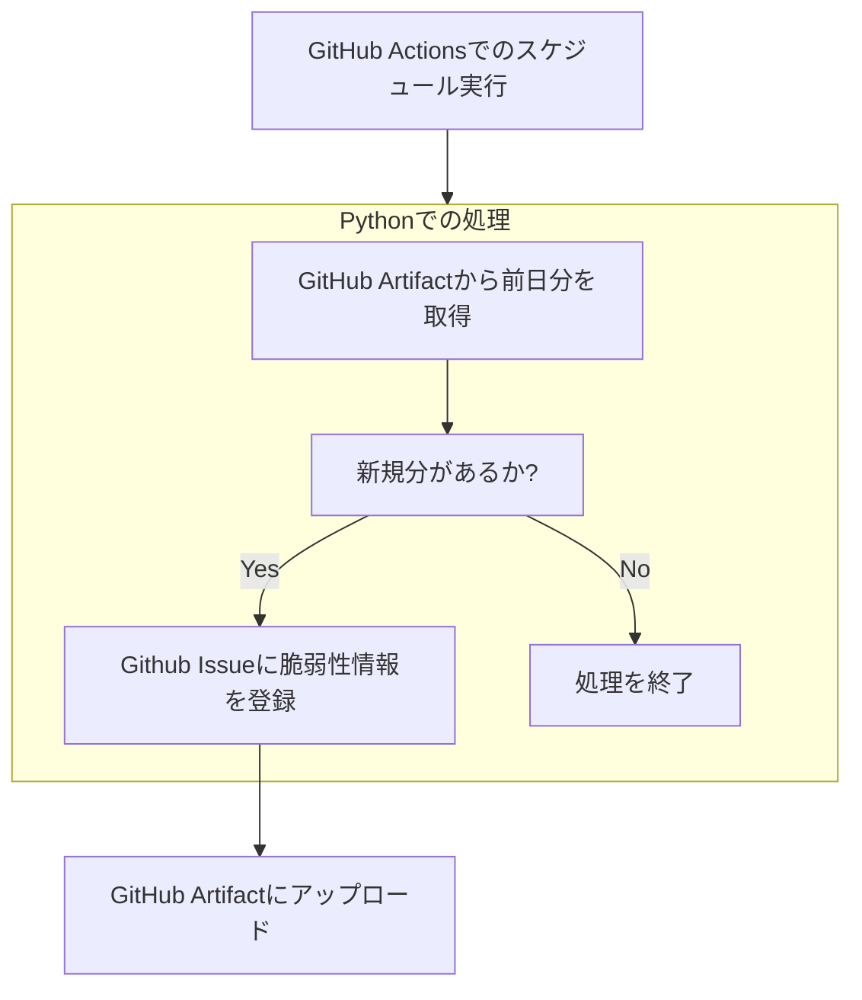

# Amazon Inspectorから脆弱性情報を取ってきてGitHub Issueに登録する

## 概要
- ACTIVEかつCRITICALの脆弱性情報を取得して、GitHub Issueに登録するPythonスクリプト
- GitHub Actionsで毎日JST10時ごろに実行するように設定している
- 記録済みの脆弱性はGitHub Artifactに保存している

## 絵

